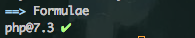
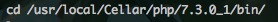
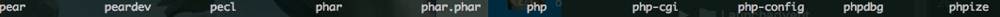
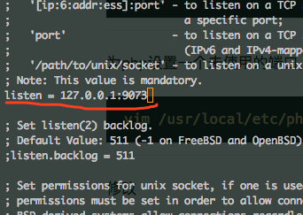
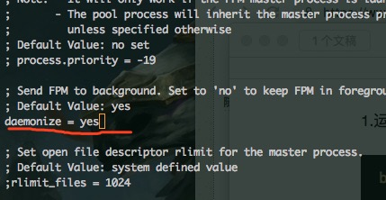
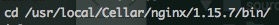
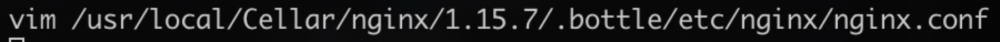
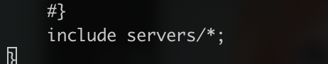
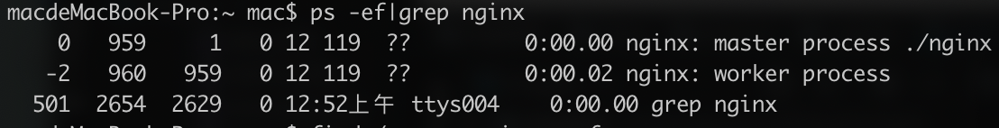

### 一、安装php7.3（鉴于7.3的兼容性，目前以下步骤对7.2亲测无问题）
1、运行命令
``` bash
	brew search php7.3
```
查看是否有7.3版本的php，正常是存在的，不存在的话请更新brew，
``` bash
	brew update
```
,然后执行安装
``` bash
	brew install php@7.3
```
安装后再次执行brew search php7.3，可以查看到当前已经安装成功
cd 到该版本php的执行目录下，，发现已经安装好了pear、pecl和phpize
，然后可以查看下php中已经启用的扩展信息，当前目录下
``` bash
	./php -m
```
2、为php设置一个未使用的端口，编辑php启动文件（注意，php7之前是php-fpm.conf文件，php7后的启动项配置是www.conf文件）
``` bash
	vim /usr/local/etc/php/7.3/php-fpm.d/www.conf
```
修改，,这里为了举例，姑且改为9073。
3、开启守护进程，打开
``` bash
	vim /usr/local/etc/php/7.3/php-fpm.conf
```
修改 ，，这样在启动php的时候就可以在后台运行而不必中断后在执行其他命令了
4、设置软连接
``` bash
	ln -s  /usr/local/Cellar/php/7.3.0_1/sbin/php-fpm   /usr/local/bin/php-fpm73
```
这样之后再启动php7.3时，只需要执行php-fpm73就可以再后台运行了，很方便吧，运行后可以用php自带的服务查看


### 二、安装nginx
1、安装
``` bash
	brew install nginx
```
查看版本信息，cd到执行目录下，这里我的是执行
``` bash
	./nginx -v
```
查看是否配置上nginx，正确的话会显示版本信息。

2、然后进行配置

首先为nginx配置到启动端口，因为默认端口是8080。这里为了用nginx驱动php，先观察下nginx的配置文件如下图
发现最后一行是读取指定目录下的配置

，然后找到该目录
``` bash
cd /usr/local/etc/nginx/servers
```
新建一个配置文件，我后面将在php7.2基础上搭建tp5，所以建立配置文件tp.test_conf,然后编辑此文件这里贴上我的配置
``` bash
server {
    listen       80;

    charset utf-8;
    #access_log  /var/log/nginx/log/weapp-access.log  main;
    #error_log   /var/log/nginx/log/weapp-error.log;

    root /Volumes/workPlace/phpProject/tp;  #网站的目录
    index index.php index.html index.htm;

    #location / {
    #    try_files $uri $uri/ /index.php?/$request_uri;
    # }

    #error_page  404              /404.html;

    # redirect server error pages to the static page /50x.html
    #
    error_page   500 502 503 504  /50x.html;
    location = /50x.html {
        root   /usr/share/nginx/html;
    }
    # pass the PHP scripts to FastCGI server listening on 127.0.0.1:9000
        #
        location ~ \.php$ {
            fastcgi_pass   127.0.0.1:9000;  #对应采用版本的php ip:端口
            fastcgi_index  index.php;
            fastcgi_param  SCRIPT_FILENAME  $document_root$fastcgi_script_name;
            include        fastcgi_params;
        }
    
        # deny access to .htaccess files, if Apache's document root
        # concurs with nginx's one
        #
        #location ~ /\.ht {
        #    deny  all;
        #}
    }
```
这里需要说明的是，我的php7.2的端口配置为了9000，所以在
fastcgi_pass 这里配置为:9000
root 配置的是tp5安装的入口文件根目录，即网站根目录，这里根据自己情况配置
保存配置后重启nginx即可（可以关闭nginx再开启，参考下面）

3、关闭nginx

我们通过寻找进程号，并杀死进程的方式来关闭nginx
``` bash
ps -ef|grep nginx
```
找到对应的进程号，这里显然是959，然后执行
``` bash
kill -9 959
```
就能够关闭nginx进程。

4、对应执行目录下执行 
``` bash
./nginx
```
或者配置软连接执行，不再赘述


### 三、安装mysql
这里有一篇教程说的很好，我就直接引入链接啦，[使用Homebrew安装Mysql[mac]](https://www.jianshu.com/p/4cb5ef29a099)


### 四、安装php扩展swoole，xdebug，igbinary，redis
cd 到该版本php的执行目录下，，
注意：1、执行哪个版本的php命令，就是把扩展安装在那个版本的php中（这里就是装在php7.3中）。2、要使用sudo执行才会成功，否则报错。
1、swoole安装
执行
``` bash
sudo ./pecl install swoole
``` 
如果想使用socket或者异步redis，可以在安装过程中的提示中对应项输入yes。
然后一路回车即可。可以参考知乎文章
https://zhuanlan.zhihu.com/p/35974610

2、xdebug安装
执行
``` bash
sudo ./pecl install swoole
``` 
3、igbinary安装
执行
``` bash
sudo ./pecl install igbinary
``` 
4、redis安装
执行
``` bash
sudo ./pecl install redis
``` 
安装扩展后会自动写入配置，无需再修改配置文件

